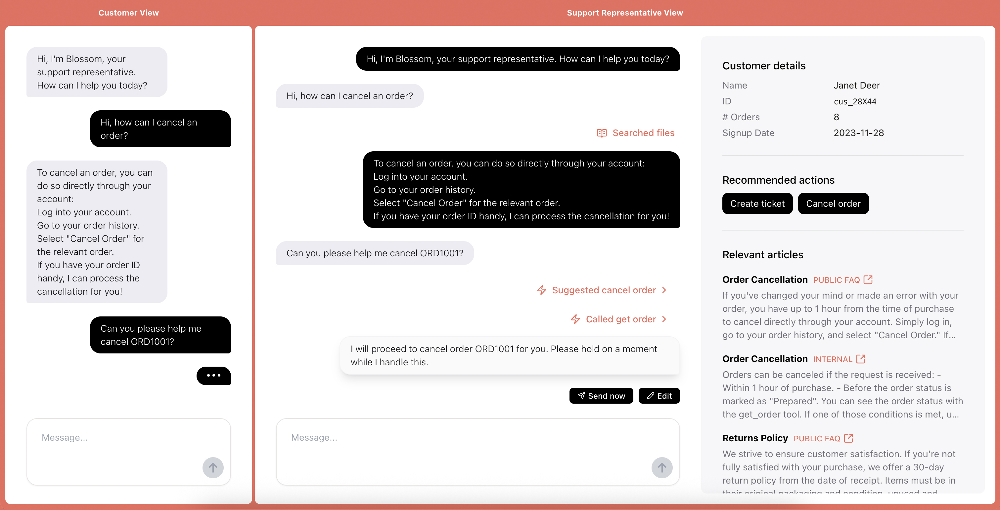

# Customer Support Agent with Human in the Loop Demo

[](LICENSE)


This repository contains a NextJS demo app of a Customer Service with a Human in the loop (HITL) use case built on top of the [Responses API](https://platform.openai.com/docs/api-reference/responses).
It leverages the [file search](https://platform.openai.com/docs/guides/tools-file-search) built-in tool and implements 2 views of a chat interface: one for the customer, and one for the human agent.

This demo is an example flow where a human agent would be assisted by an AI agent to answer customer questions, while staying in control of sensitive actions.



Features:

- Multi-turn conversation handling
- File search tool
- Vector store creation & file upload for use with the file search
- Knowledge base display
- Function calling
- Streaming suggested responses
- Suggested actions to execute tool calls
- Auto-execution of tool calls for non-sensitive actions

Feel free to customize this demo to suit your specific use case.

## How to use

1. **Set up the OpenAI API:**

   - If you're new to the OpenAI API, [sign up for an account](https://platform.openai.com/signup).
   - Follow the [Quickstart](https://platform.openai.com/docs/quickstart) to retrieve your API key.

2. **Clone the Repository:**

   ```bash
   git clone https://github.com/openai/openai-support-agent-demo.git
   ```

3. **Set the OpenAI API key:**

   2 options:

   - Set the `OPENAI_API_KEY` environment variable [globally in your system](https://platform.openai.com/docs/libraries#create-and-export-an-api-key)
   - Set the `OPENAI_API_KEY` environment variable in the project: Create a `.env` file at the root of the project and add the following line (see `.env.example` for reference):

   ```bash
   OPENAI_API_KEY=<your_api_key>
   ```

4. **Install dependencies:**

   Run in the project root:

   ```bash
   npm install
   ```

5. **Run the app:**

   ```bash
   npm run dev
   ```

   The app will be available at [`http://localhost:3000`](http://localhost:3000).

6. **Initialize the vector store:**

   Go to [`/init_vs`](http://localhost:3000/init_vs) to create a vector store and initialize it with the knowledge base. Once you have created the vector store, update `config/constants.ts` with your own vector store ID.

## Demo Flow

To try out the demo, you can ask questions that will trigger a file search.

Example questions:

- What is the return policy?
- How do I return a product?
- How can I cancel an order?

When an answer is generated, it will be displayed as a suggested response for the customer support representative.
In the agent view, you can edit the message or send it as is.

You can also click on the "Relevant articles" to see the corresponding articles in the knowledge base or FAQ.

You can then continue the conversation as the user.

You can ask for help to trigger actions.

Example questions:

- Help me cancel order ORD1001 => Should suggest the `cancel_order` action
- Help me reset my password => Should suggest the `reset_password` action
- Give me a list of my past orders => Should trigger the execution of `get_order_history`

### End-to-end demo flow

1. Ask as the user "How can I cancel my order?"
2. Confirm the suggested response
3. Ask as the user "Help me cancel order ORD1001"
4. Confirm the suggested response
5. Confirm the suggested action to cancel the order
6. Confirm the suggested response

### Limitations

Note that the functions that are executed are just placeholders and are not actually modifying any data, so the actions will not have any effect. For example, calling `cancel_order` won't change the status of the order.

## Customization

To customize this demo you can:

- Edit prompts, initial message and model in `config/constants.ts`
- Edit available functions in `config/tools-list.ts`
- Edit functions logic in `config/functions.ts`
- (optional) Edit the demo data in `config/demoData.ts`

You can also customize the endpoints in the `/api` folder to call your own backend or external services.

If you want to use this code repository as a starting point for your own project in production, please note that this demo is not production-ready and that you would need to implement safety measures such as input guardrails, user authentication, etc.

## Contributing

You are welcome to open issues or submit PRs to improve this app, however, please note that we may not review all suggestions.

## License

This project is licensed under the MIT License. See the LICENSE file for details.
